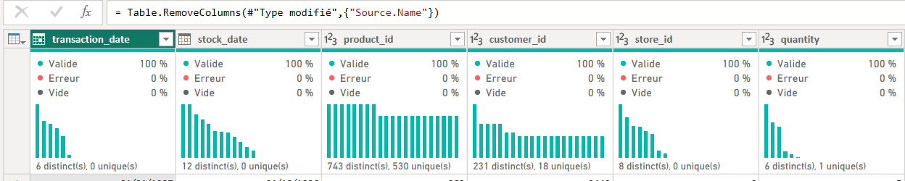

# MavenMarket_PowerBI
Business Intelligence project built with the MavenMarket dataset (Kaggle). Includes data cleaning, data modeling, DAX, and Power BI dashboard.
# 📊 PROJET BUSINESS INTELLIGENCE : MAVEN MARKET RAPPORT

Ce projet est une analyse détaillée de la performance des transactions de Maven Market, réalisée sous **Power BI Desktop**. L'objectif est de mettre en place une solution BI complète (ETL, Modélisation, DAX) qui sert de rapport interactif pour l'aide à la décision.

---

## 📌 Aperçu du Résultat Final (Quick Look)

Voici le produit final, le tableau de bord principal qui inclut la filtration par pays et l'analyse de rentabilité :

---

## 🛠️ I. Préparation et Transformation des Données (Power Query / ETL)

Cette phase assure la qualité, la gestion des types de colonnes et la consolidation des données sources avant leur chargement.

### 1. Vue de l'Interface Power Query

L'interface de l'éditeur Power Query montrant la structure de travail.

### 2. Vue d'Ensemble des Données Brutes

Visualisation de la Table de Faits avant le nettoyage, montrant les premières statistiques de validité des colonnes (Basée sur l'image 'Focus Table de Fait').

### 3. Étapes de Nettoyage Appliquées

Détail des étapes de transformation appliquées (changement de types, renommage, gestion des dates, consolidation) dans Power Query pour garantir la qualité de la Table de Faits.

### 4. Fusion des Données

Détail de l'étape de fusion (Merge) ou de combinaison (Append) des différentes sources de données.

***

## 🏗️ II. Modélisation des Données (Star Schema)

Le modèle est construit pour la rapidité d'exécution des requêtes et la flexibilité de l'analyse, en respectant le schéma en étoile.

### 5. Vue Relations du Modèle Final

Le Schéma en Étoile complet montrant la liaison entre les Tables de Faits et toutes les Tables de Dimensions par des relations (1 à N).
.png)

### 6. Focus sur les Tables de Faits et Dimensions

Détail de la Table de Fait centrale qui agrège les transactions, et des tables de dimensions qui fournissent le contexte d'analyse.

***

## 🧮 III. Calculs DAX et Indicateurs Clés (KPIs)

Définition des mesures complexes pour l'analyse financière (Marge, Bénéfice) et l'analyse temporelle (Année-à-Date).

### 7. Mesures Simples (Mesure Simple)

Calculs basés sur les transactions pour les totaux simples (ex: Total des Transactions, Revenu Total).

### 8. Mesures Avancées (Mesure Avancée)

Calculs complexes pour les indicateurs clés de performance tels que la Marge bénéficiaire.

### 9. Time Intelligence (Analyse Temporelle)

Utilisation des fonctions DAX avancées pour le calcul des indicateurs cumulatifs (comme le Revenu YTD) et l'analyse des tendances.

***

## 📊 IV. Analyse et Interactivité du Rapport

Présentation des pages de rapport, des KPIs finaux et de la preuve de l'interactivité du tableau de bord.

### 10. Le Tableau de Bord Final (Première Version)

Le rapport final intégrant tous les KPIs (Transactions, Bénéfices, Rendement) et les analyses géographiques et temporelles.

### 11. Le Tableau de Bord Final (Version Complète)

Le rapport final après toutes les retouches visuelles, prêt à l'emploi.

### 12. Focus Visuel sur l'Interactivité (Analyse Active)

Mise en évidence de l'interactivité du rapport: un clic sur un segment (ex: un pays ou une catégorie) filtre dynamiquement le reste du tableau de bord.

